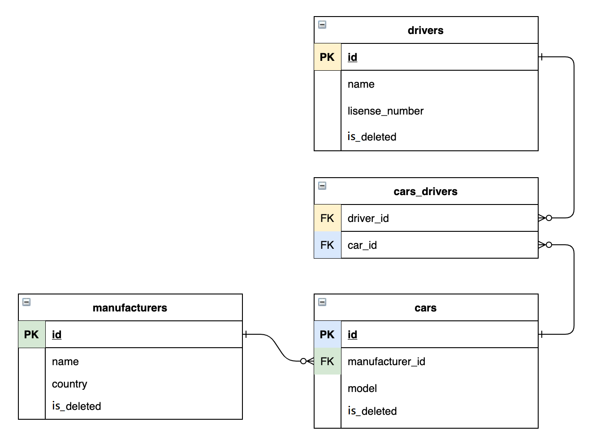

# Taxi Service

##Contents
+ [Overview](#Overview) 
+ [Use cases](#Use cases)
+ [Used Technologies](#Used Technologies) 
+ [Project structure](#Project structure)
+ [Application startup](#Application startup)

##Overview
Taxi service is a web application that can be used to keep a record of taxi drivers and cars. 
By using a taxi service you can create, read, update and delete records of taxi drivers, cars, and car manufacturers from your database.

##Use cases
When you enter the application website you enter like a guest and you have access only to these actions:
* Login as a driver
* Register a new driver
When you will log in as a driver, you could perform these actions:
* See all cars, taxi drivers, or car manufacturers
* Add to car record info about its driver(s)
* See all cars which linked to the current logged in driver
* Delete car, taxi driver, or car manufacturer from the database
* Remove driver from cars drivers list

##Used Technologies
* Apache Tomcat (v9.0.50)
* MySQL
* JDBC
* HttpServlet and HttpFilter
* HTML, CSS, JSP, JSTL
* Maven
* Maven Checkstyle Plugin

##Project structure
Project implemented refers to an n-tier structure and has three layers:

1. Data access layer (DAO)
1. Application layer (service)
1. Presentation layer (controllers)

Table relations 

##Application startup

1. Configure Apache Tomcat(or another servlet container) for your IDE
1. Install MySQL
1. Create a database by using the SQL queries from the `init_db.sql` file
1. Change `username`, `password` and `URL` values in the `/util/ConnectionUtil.java` to open a connection with your database
1. Launch application and start using it at `http://localhost:%your_port%`
